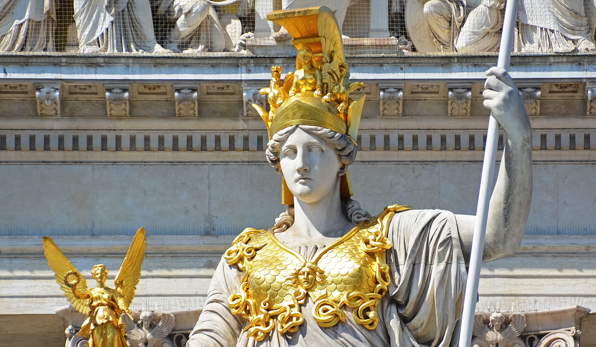

# `README.md` for [athena](https://github.com/Ai-Yukino/athena)

    

[🖼 Jeremy Bezanger | Unsplash](https://unsplash.com/photos/utp3lWnU4nA)

---

💧🔥 Extracting data from the following Wikipedia pages:

- [List of 2020 Summer Olympics medal winners](https://en.wikipedia.org/wiki/List_of_2020_Summer_Olympics_medal_winners)
- [List of 2022 Winter Olympics medal winners](https://en.wikipedia.org/wiki/List_of_2022_Winter_Olympics_medal_winners)
- [List of LGBT Olympians](https://en.wikipedia.org/wiki/List_of_LGBT_Olympians)
